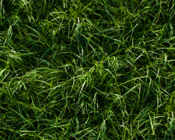
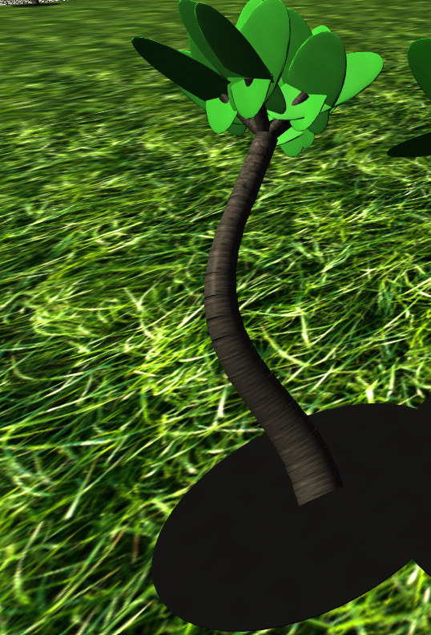
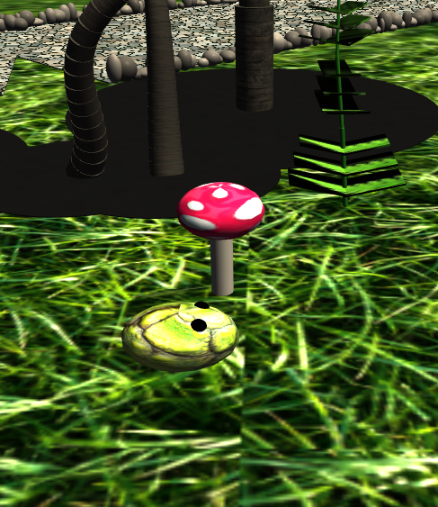
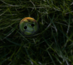
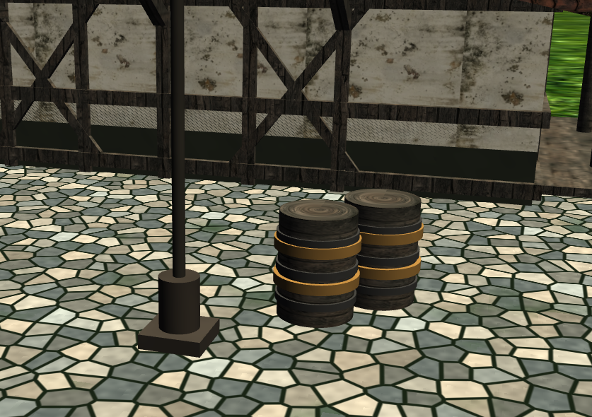
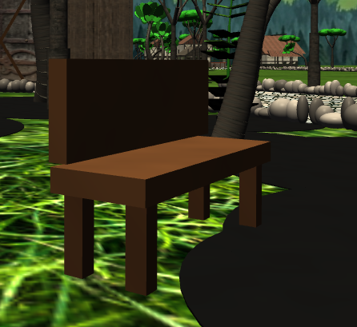
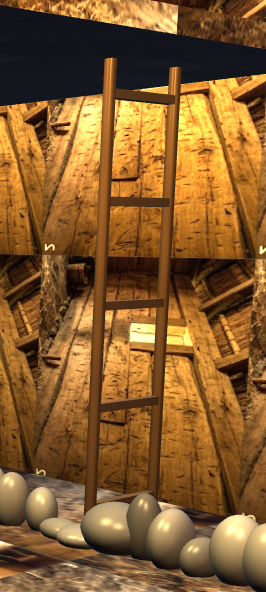
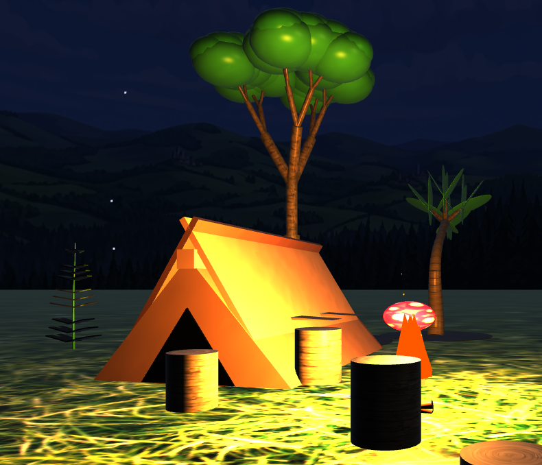
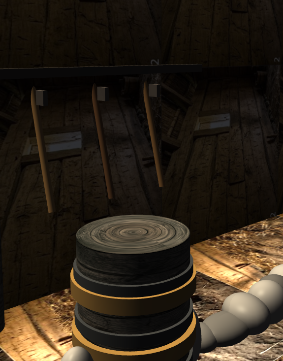
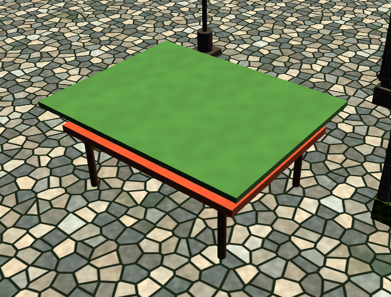

# 🏰 Medieval Adventure — OpenGL 3.3 Real-Time 3D World

> **Author:** Tasfia Zaman Samiha  
> **Engine:** OpenGL 3.3 Core Profile | C++ | GLSL Shaders  
> A fully hand-crafted real-time 3D medieval world built from scratch — no game engine, no shortcuts.

---

## 🎬 Demo Video

[](https://youtu.be/QfCPqHlLZTE)

**▶️ [Watch Full 8-Minute Demo on YouTube](https://youtu.be/QfCPqHlLZTE)**

---

## 🖼️ Screenshots

### 🌅 Full World — Day Mode
.png)

### 🌧️ Rain Mode
.png)

### 🌫️ Fog Mode
.png)

### 🌙 Night Mode
.png)

---

## 🌍 World Zones

### 🏘️ Village Site


### 🛖 Village Market


### 🏰 Castle (Full View)
.png)

### 🏰 Castle (Close-Up)
.png)

### 🗼 Watch Tower


### 🚩 Watch Tower Flag


### 🔥 Campsite & Fireplace
.png)

### 🏚️ Barn (Exterior)


### 🪜 Barn Interior


### 🏠 Barn Upper Floor


### 🏠 House 1


### 🏠 House 2


### 🏠 House 3


### 🛋️ Interior Design


---

## 💡 Lighting & Illumination

### Phong Lighting Model
.png)

### Illumination — Scene 1


### Illumination — Scene 2


### Illumination with Fog
.png)

### 🌌 Night Sky


### 🔦 Street Lamp


---

## 🌿 Nature & Environment

### 🌱 Grass (Procedural Triplanar)


### 🌳 Tree Type 1


### 🌲 Tree Type 2


### 🍄 Mushroom


### 🌿 Fern (Fractal Pinnate)


### 🐸 Frog (Animated)


---

## 🛖 Props & Objects

### 🪵 Barrels


### 🪑 Bench


### 🪜 Ladder


### ⛺ Tent


### 🪓 Axe


### 🪑 Table


### 🧥 Boutique Clothes (Market Stall)


### 🧍 Human NPC


### 🚧 Direction Fence


### 🚧 Direction Fence 2


---

## ✨ Feature Overview

### 🌍 World & Scenes
**6 distinct zones** connected by a branching S-curve cobblestone road network:

| Zone | Contents |
|------|----------|
| 🌲 Forest Entrance | Fairy ring of mushrooms, ancient ruins, stone paths, fractal trees |
| 🔥 Campsite | Animated fire, tent, stumps, barrels, fractal ferns, jumping frogs |
| 🏘️ Village | Manor, townhouse, cabin, barn, market stalls, NPC walking |
| 🏰 Castle | Curtain walls, 4 towers, gatehouse, portcullis, inner keep |
| 🗼 Coastal Tower | Battlements, waving flag, glowing windows at night |
| 🏙️ Medieval Town | Great hall, lamp posts, benches, wells, hanging banners |

---

### 🎨 Rendering & Shaders
- **Custom GLSL shaders** (vertex + fragment, OpenGL 3.3 Core)
- **8 Procedural Material Types**:
  - Grass — triplanar UV mapping + 4-octave fractal Brownian motion noise
  - Cobblestone — Voronoi tessellation + moss growth simulation + normal perturbation
  - Animated Water — ripple normals + time-based sine wave displacement
  - Dirt / Road — multi-layer noise with rut simulation
  - Procedural Wood / Marble — ring pattern from fBm distance
  - UV-mapped image textures
  - Triplanar image mapping (no UV stretching on any geometry)
- **Multi-source Phong lighting**: Sun · Moon · Campfire · Up to 12 lamp posts
- **Height-biased exponential fog** — adjustable density with `+/-` keys
- **Wet rendering** — surfaces darken, cobblestone gains specular gleam in rain
- **Thunder lightning flash** — full-scene brightness pulse with sound effect
- **Sky dome** with horizon panorama, smooth day/night/rain color blending
- **Subtle desaturation pass** for realistic tone mapping

---

### 🌿 Procedural & Fractal Generation

| Element | Algorithm |
|---------|-----------|
| Trees (Type 1) | Bezier curved trunk + 4-branch recursive curly canopy |
| Trees (Type 2) | Binary-split fractal branching (depth 5, iterative stack) |
| Ferns | Pinnate frond structure + organic wind sway (time-based) |
| Ivy | Recursive wall-climbing with colored petal blooms |
| Snowflakes | Recursive hexagonal Koch-like pattern |
| Cobblestone | Voronoi cells + soft mortar gap + fBm moss |
| Grass terrain | 4-octave fBm: large patches → medium → fine → micro |
| Road stones | Procedural edge scatter with size/angle variation |

---

### 🎭 Animations

| Element | Type |
|---------|------|
| NPC Human | Walk cycle — bob, arm swing, knee bend, yaw tracking |
| Frogs | Parabolic leap with fade-out reset cycle |
| Campfire | 8 flickering flame tongues + orbiting sparks |
| Barn Door | Smooth hinge pivot (animated open/close) |
| Hanging Banners | Quadratic Bezier wind sway |
| Market Stall Canopy | Per-strip sine wave draping |
| Birds | Flock formation with independent wing flap |
| Clouds | Horizontal drift (day only) |
| Waving Flag | Per-segment sinusoidal wave |
| Water Surface | Animated normal + color shimmer |
| Rain | 750 dynamic line particles (repositioned per frame) |

---

### 🎮 Controls

| Key | Action |
|-----|--------|
| `LMB` | Capture mouse / Enter look mode |
| `WASD` | Move forward / back / strafe |
| `Q` | Fly up |
| `E` | Fly down |
| `Mouse` | Look (yaw / pitch) |
| `Scroll` | Zoom FOV |
| `Shift` | Sprint (1.8× speed) |
| `N` | Toggle Night ↔ Day |
| `R` | Toggle Rain ↔ Clear |
| `LMB` (in rain) | Trigger thunder flash + sound |
| `P` | Open / Close barn door |
| `O` | Toggle barn lantern lights |
| `G` | Grab / Release nearest barrel |
| `+` / `-` | Increase / Decrease fog density |
| `ESC` ×1 | Release mouse cursor |
| `ESC` ×2 | Quit application |

---

### 🛡️ Collision System
- Cylinder-based obstacle detection for all major structures
- **Slide response** — WASD movement slides along walls instead of stopping
- Camera radius: 0.4 units

---

## 🛠️ Technical Stack

| Component | Detail |
|-----------|--------|
| Language | C++17 |
| Graphics API | OpenGL 3.3 Core Profile |
| Windowing | GLFW 3 |
| GL Loader | GLAD |
| Math Library | GLM |
| Image Loading | STB Image (`stb_image.h`) |
| Audio | Windows Multimedia API (`winmm.lib`) |
| Platform | Windows |

---

## 🔧 Shader Details

### Vertex Shader Input Layout
```glsl
layout(location = 0) in vec3 position;   // XYZ world position
layout(location = 1) in vec3 normal;     // surface normal
layout(location = 2) in vec2 texCoord;   // UV coordinates
```

### Fragment Shader — Material Dispatch
```
matType 0 → Solid color + procedural surface variation
matType 1 → Grass   (triplanar sampling + 4-octave fBm)
matType 2 → Cobble  (Voronoi + moss + normal perturbation)
matType 3 → Water   (animated sine wave normals)
matType 4 → Dirt    (multi-noise + rut pattern)
matType 5 → Mixed   (checkerboard × objectColor)
matType 6 → Procedural wood/marble ring pattern
matType 7 → Standard UV-mapped texture
matType 8 → Triplanar projected texture (no stretching)
```

### Key Lighting Uniforms
```glsl
uniform vec3  sunDir,   sunColor;    float sunIntensity;
uniform vec3  moonDir,  moonColor;
uniform vec3  firePos,  fireColor;   float fireIntensity;
uniform vec3  lampPos[12];           float lampIntensity;
uniform int   numLamps;
uniform float dayFactor;             // 0.0 = night, 1.0 = day
uniform float fogDensity;
uniform float thunderEffect;         // 0.0 → 1.0 flash intensity
uniform int   isRaining;
```

---

## 📁 Project Structure

```
medieval-adventure/
├── main.cpp              # Full rendering engine (~3500+ lines)
├── vertex.vert           # Vertex shader
├── fragment.frag         # Fragment shader (all 8 material types)
├── stb_image.h           # Single-header image loader
├── README.md
└── textures/             # 40+ reference screenshots + scene textures
    ├── grass.png
    ├── castle.png
    ├── house wall.png
    ├── house windows.png
    ├── medieval_roof_tiles_*.png
    ├── medieval_wood_beams_*.png
    ├── mushroom .png
    ├── farn .png
    ├── barn wall.png
    ├── fantasy_sky_horizon.png
    ├── face.png / torso.png / arms.png
    ├── legs.png / boots.png / hands.png
    ├── thunder.wav
    └── [full world & element screenshots]
```

---

## 🏗️ Build Instructions

```bash
# MinGW / GCC
g++ main.cpp -o medieval_adventure.exe ^
    -lglfw3 -lopengl32 -lwinmm -lgdi32 -lstdc++

# Or open in Visual Studio and link:
# glfw3.lib, opengl32.lib, winmm.lib
# Include paths: GLFW/include, GLAD/include, GLM
```

---

## 👩‍💻 Author

**Tasfia Zaman Samiha**

> *"Every triangle, every shader, every animation — written entirely by hand. No game engine. Pure OpenGL."*

---

## 📄 License

This project is created for educational and portfolio purposes.
